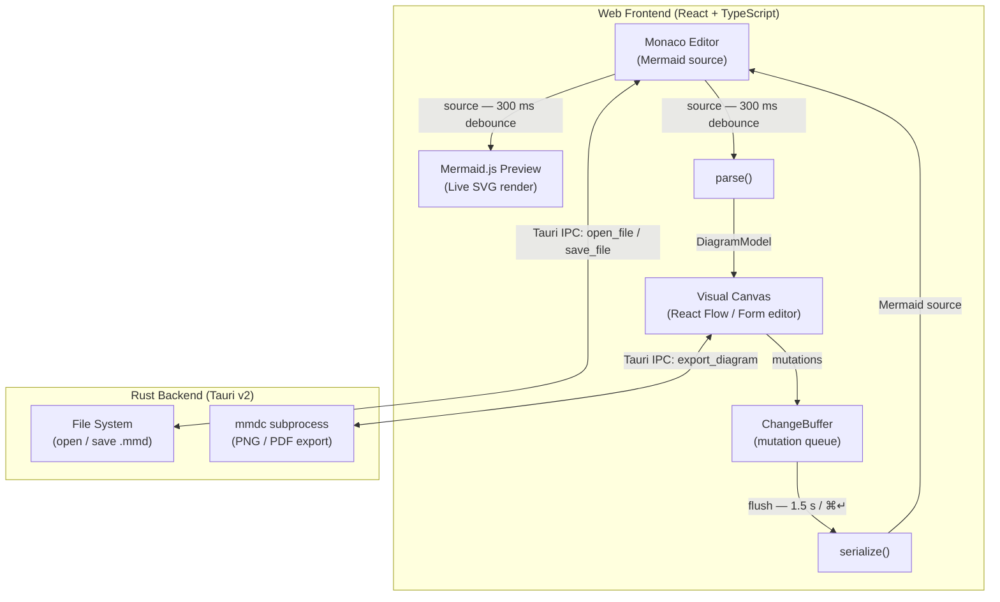
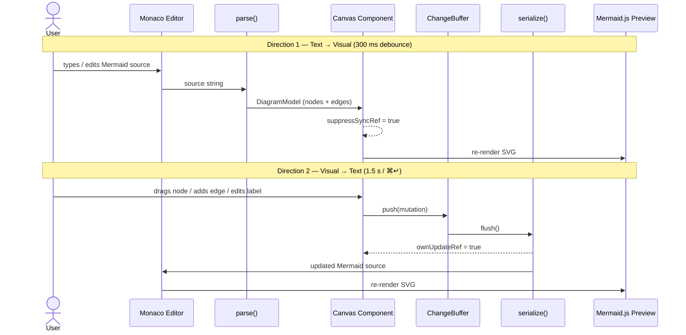

# Architecture — Mermaid Visual Editor

> Living reference document. Update as decisions are made.

## Overview

A Tauri v2 desktop application for visually editing Mermaid diagrams.



_Open in editor: [`docs/component-graph.mmd`](component-graph.mmd)_

## Buffered Sync Model

The key design insight: changes are buffered rather than continuously synced.

### Text → Visual (debounced ~300ms)
1. User types in Monaco Editor
2. Source string is passed to `parse()` → `GraphModel`
3. React Flow canvas re-renders from the new model

### Visual → Text (on explicit commit)
1. User drags a node / adds an edge / edits a label on the canvas
2. Each mutation is appended to the `ChangeBuffer` via `changeBuffer.push()`
3. On "Apply" button click or auto-save interval: `changeBuffer.flush()`
4. Flush calls `serialize(model)` → regenerates Mermaid syntax
5. Monaco editor updates to the new source

This avoids the hardest problem (perfect round-trip AST parsing for all diagram types) and gives a natural commit UX.



_Open in editor: [`docs/sync-loop.mmd`](sync-loop.mmd)_

## Directory Structure

```
src/
  components/
    Editor/         Monaco Editor wrapper + Mermaid language registration
    Canvas/         React Flow visual editor (Phase 2)
    Preview/        Mermaid.js SVG renderer
  lib/
    buffer.ts       ChangeBuffer — accumulates visual mutations
    parsers/        Mermaid text → GraphModel, per diagram type
    serializers/    GraphModel → Mermaid text, per diagram type

src-tauri/
  src/
    main.rs         Entry point
    lib.rs          Tauri builder + IPC command handlers
  capabilities/
    default.json    Tauri v2 permission declarations
  tauri.conf.json   App config (window, bundle, build commands)
  Cargo.toml        Rust dependencies

docs/
  architecture.md      This file
  toolchain-decision.md ADR for Tauri selection
```

## Implementation Phases

| Phase | Status | Description |
|---|---|---|
| 0 | Done | Scaffold: Tauri + Vite + React + Monaco + Tailwind |
| 1 | Done | Core editor: Monaco + Mermaid preview + file I/O |
| 2 | Done | Visual editing: React Flow canvas + form editors (sequence/gantt/pie) |
| 3 | Done | Multi-tab, export (PNG/PDF/SVG), keyboard shortcuts |
| 4 | Deferred | AI integration (Claude API) |

## Open Questions

- Which Mermaid AST library to use? (`@mermaid-js/parser` is official; may lag spec)
- React Flow vs custom layout for non-flowchart types (sequence diagrams need swimlane layout)
- Bundle `mmdc` with the app or require external install?

## Notes

- Icons: run `cargo tauri icon path/to/icon.png` to generate all required icon sizes
- Cross-compilation: use `tauri-action` GitHub Action for CI multi-platform builds
- Nix: `nix develop` provides the full dev shell including WebKit2GTK
