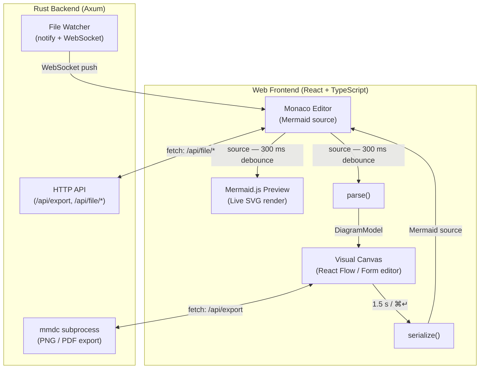
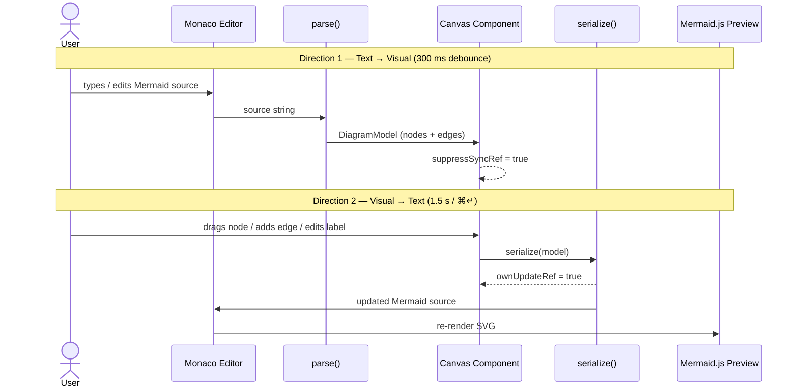

# Architecture — Mermaid Visual Editor

> Living reference document. Update as decisions are made.

## Overview

A browser-based application for visually editing Mermaid diagrams. Axum (Rust) server backend with a React/TypeScript frontend.



_Open in editor: [`docs/component-graph.mmd`](component-graph.mmd)_

## Buffered Sync Model

The key design insight: changes are buffered rather than continuously synced.

### Text → Visual (debounced ~300ms)
1. User types in Monaco Editor
2. Source string is passed to `parse()` → `DiagramModel`
3. React Flow canvas re-renders from the new model

### Visual → Text (auto-sync 1.5s or ⌘Enter)
1. User drags a node / adds an edge / edits a label on the canvas
2. `useEffect([nodes, edges])` debounces 1.5s, then calls `serialize(model)`
3. `onSourceChange(newSource)` bubbles up to `App` → Monaco updates
4. `ownUpdateRef` prevents the resulting `source` prop change from triggering a re-parse



_Open in editor: [`docs/sync-loop.mmd`](sync-loop.mmd)_

## Directory Structure

```
src/
  client/
    main.tsx              React entry — mounts <App />, imports React Flow CSS
    index.css             Global styles (Tailwind + CSS variables + utility classes)
    App.tsx               Root component: tabs, panels, toolbar, status bar, shortcuts
    components/
      Editor/             Monaco Editor wrapper + Mermaid language registration
      Canvas/             React Flow visual editor + form editors per diagram type
      Preview/            Mermaid.js SVG renderer
      Resizable/          Draggable split-pane
      DiagramTypePicker/  Popover for switching diagram type
    lib/
      api.ts              Server API client (replaces Tauri IPC)
      watchClient.ts      WebSocket client for file watching
      fileOps.ts          File open/save with server API + browser fallback
      parsers/            Mermaid text → DiagramModel, per diagram type
      serializers/        DiagramModel → Mermaid text, per diagram type
      layout.ts           BFS layered layout for flowchart nodes
      templates.ts        Starter diagram source per type

  server/
    Cargo.toml            Rust dependencies (axum, tokio, notify, rust-embed, clap)
    src/
      main.rs             CLI args, bind port, open browser
      lib.rs              Public module exports
      routes.rs           Router: /api/*, /ws, static fallback
      export.rs           POST /api/export (mmdc subprocess)
      files.rs            File read/write/session endpoints
      watch.rs            notify + WebSocket file change push
      state.rs            Shared AppState (initial files, watched paths)

docs/
  architecture.md         This file
  dev-guide.md            Developer onboarding guide
```

## Implementation Phases

| Phase | Status | Description |
|---|---|---|
| 0 | Done | Scaffold: Vite + React + Monaco + Tailwind |
| 1 | Done | Core editor: Monaco + Mermaid preview + file I/O |
| 2 | Done | Visual editing: React Flow canvas + form editors (sequence/gantt/pie) |
| 3 | Done | Multi-tab, export (PNG/PDF/SVG), keyboard shortcuts |
| — | Done | Migration: Tauri → Axum server + browser UI |
| 4 | Deferred | AI integration (Claude API) |

## Open Questions

- Which Mermaid AST library to use? (`@mermaid-js/parser` is official; may lag spec)
- React Flow vs custom layout for non-flowchart types (sequence diagrams need swimlane layout)
- Bundle `mmdc` with the app or require external install?

## Notes

- Export formats: SVG is instant (client-side mermaid.js render); PNG/PDF invoke `mmdc` via the server
- Production binary embeds the frontend (`dist/`) via `rust-embed` — single self-contained executable
